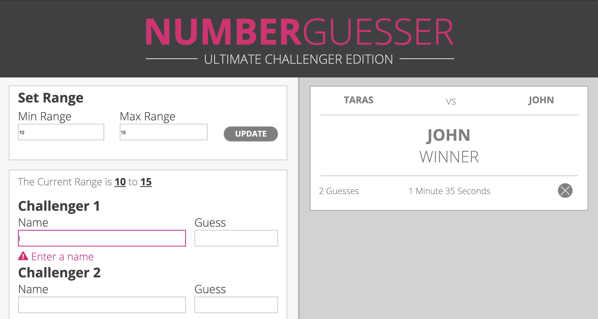
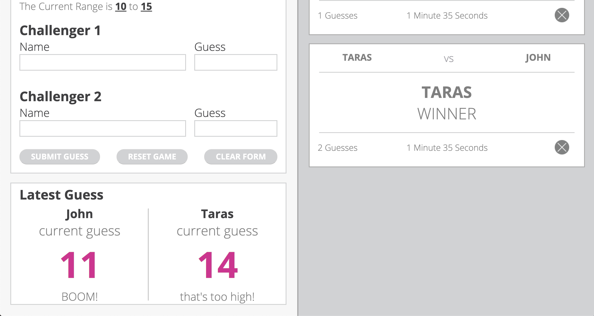
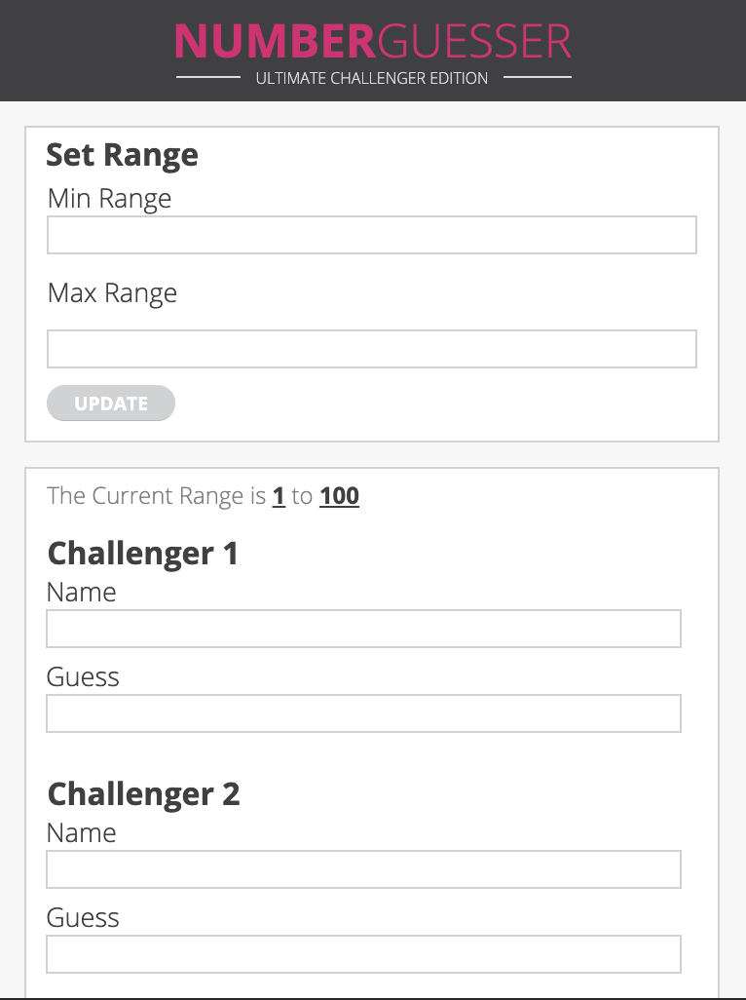
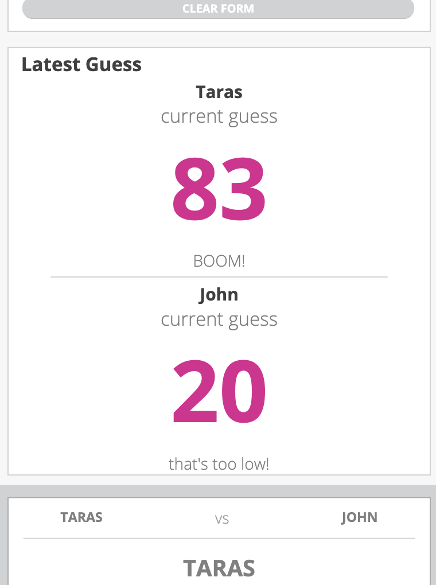

### NUMBER Guesser

__Number guesser was my first paired project. The goal of this project was to create simple 'game' that allows two players to guess a randomly generated number. This project was done in roughly 4 days.__

In the _number guesser_ there can only be one winner!

Make sure to grab a friend! This game requires 2 people to play _(ages 5+)…_
As a user you have the option to attempt a guess on a random number between 1 and 100, or you can set a custom range of numbers that you want to attempt a guess on.

Each player is required to enter their name and guesses in the spaces provided. After entering and SUBMITTING your name and guess, you will receive feedback from the game on whether your guess was ‘too high’, ‘too low’, OR __‘BOOM!’__ — You just won the game!

After guessing and winning the game, the winners credentials are displayed in a card on the right-hand side of the screen. These cards will populate as each player wins, so that you and your rival can keep diligent track of who has won the most games!

HINT: _If you want to throw your opponent off the trail hit the ‘X’ in the bottom right hand corner of their winner card, and delete it!_ __Ha!__

That’s all there is to it. Have yourselves some fun and may the guessing commence!

__Love,__

_John & Taras Turing FEE 1911_

### Technologies Used

* HTML
* CSS
* Vanilla JavaScript  

## Learning Goals
* Practice Dom manipulation.  
* Gain basic understanding of JavaScript, practicing eventListeners and innerHTML.
* Solidify CSS grid and flex box understanding and basic HTML. 
* Practice working in pairs, including paired coding and divide and conquer approaches. 
* Utilize GitHub and git branches.
* Practice branching, merging and pull requests.

## Challenges

The most difficult part of this project was learning how to work on a project with two people coding. Being this was my first paired project it was a challenge. We made sure to write out a comprehensive DTR and have a retro at the end of every day. I was very lucky to work with John on this project as he is very knowledgeable and works very well in a group. 

## Wins
Biggest win for this project was successfully completing it even though both John and I were sick with a flu and 103 degree fever.  Because of this circumstance we got to use Slack screen sharing and also Mac OS built in screen sharing which was very useful.

